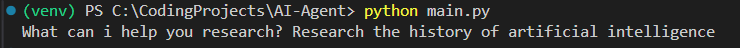

This project is an AI research assistant that implements agentic workflows using LangChain. The system autonomously decides which tools to use - web search, Wikipedia, or file saving - based on the research query.

# Installation
### 1. Clone the repository
```bash
git clone https://github.com/aconstas/ai_agent.git
cd ai_agent
```
### 2. Set Up Virtual Environment
```bash
python -m venv venv

#Activate virtual environment
# Windows: venv\Scripts\activate
# macOS/Linux: venv/bin/activate
```
### 3. Install dependencies
```bash
pip install -r requirements.txt
```
### 4. Environment Configuration
Create a `.env` file in the root directory and add your API keys:
```env
ANTHROPIC_API_KEY=your_anthropic_api_key_here
OPENAI_API_KEY=your_openai_api_key_here
```
# Usage
1. Execute the following command:
```bash
python main.py
```
2. Then type your research query in the terminal and press `Enter`.



3. You will see a file named "research_output.txt" in the repositories root folder. (There is an example "research_output.txt" in the repository).

# Pydantic
**Pydantic** is a data validation library that ensures data matches a specific structure and format -- like a contract.

In this project, we inherit from Pydantic's BaseModel class:
```python
    class ResearchResponse(BaseModel):
        topic: str
        summary: str
        sources: list[str]
        tools_used: list[str]
```
This data validation is important to include in the project because AI models are currently notorious for producing unpredictable output formats.

If we were not using Pydantic, the underlying model may produce something like:
```
"Here's what I found about climate change. The topic is climate change and I used search and wikipedia tools. Here are some sources: nasa.gov, epa.gov..."
```

With Pydantic, it forces the AI to return structured data like so:
```json
{
    "topic": "climate change",
    "summary": "Climate change refers to long-term shifts...",
    "sources": ["nasa.gov", "epa.gov", "ipcc.ch"],
    "tools_used": ["search", "wiki_tool"]
}
```

This line creates instructions that get sent to the AI telling it exactly how to format its response:
```python
parser = PydanticOutputParser(pydantic_object=ResearchResponse)
```
**PydanticOutputParser** is a LangChain class that acts as a bridge between AI models and structured data. It works like a translator that:
1. Tells the AI how to format its response.
2. Validates the AI's response matches that format.
3. Converts the raw text into a usable Python object.
